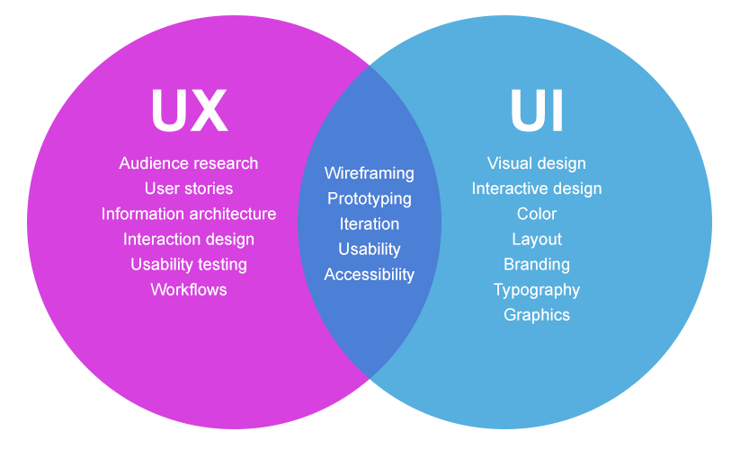

# A4: Usability Test w/ Bootstrap

Create and conduct a usability test, then design and code a page to present your results!

## Part I: Create a usability test

In your group, develop a series of tasks for a usability test. `20 min`

1. Begin by discussing key ideas from the usabilty readings, reviewing the steps in this assignment, and brainstorming on strategies for creating your test. Use this article for inspiration, "[The Ultimate Step-by-Step Guide on Website Usability Testing](https://kinsta.com/blog/website-usability-testing/)" `7 min`
1. Select a website to test that is relatively-popular, locally or [across the whole internet](https://moz.com/top500). `3 min`
1. Create a list of five realistic tasks (e.g. find information or perform a specific function) for a user to complete on that website.  `10 min`
1. Designate someone from your group to be a test user.
1. The test user from your group will then switch with the test user from *another* group (so that completing the five tasks is a new experience). If completing this assignment on your own then ask a roommate or friend to be your test user.

## Part II: Conduct your usability test

In your group, perform the usability test and record data. `10 min`

1. Ask your new test user to complete each task, one at a time.
1. Record their responses noting the following `10 min`
	1. Your goal is to test the website (not the user) in order to discover issues. It is therefore good if your test user has trouble with any of your tasks.
	1. Observe your test user and make notes but do not help or interfere. Watch their eye and mouse activity (recall the [eye-tracking experiments](https://duckduckgo.com/?q=eye+tracking+usabilty&iax=images&ia=images) from class presentations)
	1. Ask the user to “think aloud” to help your group understand why they are making choices.
1. For each question, record the following:
	1. **Time**: How long does it take to complete each task?
	1. **Accuracy**: How many mistakes did they make and how fast did they recover?
	1. **Recall**: How much do they remember on multiple uses? Did they get better at using the website over time?
	1. **Emotional response**: How did they feel after using the website?

## Part III: Compile data

In your group, compile all information you collected into a single report (like in a shared Google Doc). `15 min` Include:

1. Your name(s), a link to and screenshot of website chosen for analysis
1. List the 5 tasks you gave the user and include the data and a discussion of the result of each. Was the user successful in completing the task? Why or why not?
1. Include a screenshot (⌘ + Shift + 4 on Mac) for each question, whether positive or negative, focussing on the element(s) of the website that led to the success or failure of the task.
1. What recommendations could you make to the website owner?
1. Use class materials on usability to inform your report. Use additional resources from the internet to help communicate your findings, for example "[The Ultimate Step-by-Step Guide on Website Usability Testing](https://kinsta.com/blog/website-usability-testing/)"

## Part IV: Design reports

Each group member will **individually** design and code their own single-page website to present the results of the usability test.

1. Fork this repository and clone it to your `critical-web-design` folder on your machine.
1. Design
	1. As in previous assignments, start with `designs/1.psd`.
	1. First create a wireframe, then create multiple (3+) design iterations, following class [presentations](https://docs.google.com/presentation/d/1BiIHVEQjmIb2k2vB6N3x1g_S3KSLyZq2YCniq1ONjg8/edit?usp=sharing).
	1. Look at relevant examples of good design to help you improve your own, while prioritizing communication of your groups' findings.
	1. Research similar designs and try new things. Use the actual content of your report in the design.
1. HTML/CSS
	1. Once you have a satisfactory design, code your design inside `index.html`.
	1. Use the Bootstrap framework and a [single page design](https://www.google.com/search?q=single+page+design) (for example [webflow.com](https://webflow.com), [humaaans.com](https://humaaans.com)).
	1. Include results, recommendations, screenshots, and data from above.
	1. Do not use a [Bootstrap template](https://startbootstrap.com/). One of the goals of this assignment is for you to create and code a custom design.
	1. Save your work and commit and push changes regularly
1. Confirm valid [HTML](https://validator.w3.org/) and [CSS](https://jigsaw.w3.org/css-validator/). Note: Only *your* CSS files because Bootstrap's built-in support for older browsers [will not validate](https://getbootstrap.com/docs/4.5/getting-started/introduction/))
1. When finished, [publish and post your project](https://docs.google.com/document/d/17U_zmzM_eML_qkG0PaOdDRcEk3YEmbiQ1TyNnbAM08k/edit#bookmark=id.8jryplv1i8a)
1. Refer to this [rubric](https://docs.google.com/document/d/1daQKCtPQCRhu2RhqHZbqBKVeJP7OcyCypLadfn14zBA/edit) for grading.

 ## Resources

 - Course [HTML & CSS Resources](https://github.com/omundy/critical-web-design/blob/master/README.md#html--css)
 - Bootstrap [documentation](https://getbootstrap.com/docs/)
